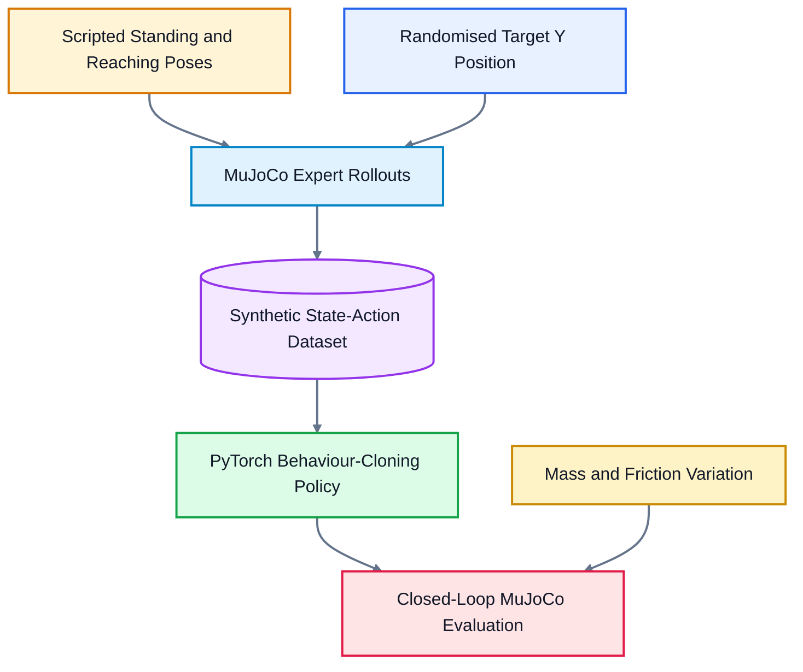

# Centaur-WBC: Learned Whole-Body Reaching in MuJoCo

**Centaur-WBC** is a simulation-based imitation-learning prototype for
coordinated whole-body reaching with an arm-equipped quadruped-style robot.

The project combines an 11-actuator MuJoCo robot, scripted expert pose
transitions, synthetic state-action generation, PyTorch behaviour cloning,
target-position variation, and physics-parameter randomisation.

The learned policy predicts coordinated leg and arm position commands from
the current simulated state and target information.

> **Current scope:** Centaur-WBC is evaluated only in MuJoCo simulation.
> The current implementation demonstrates learned whole-body pose coordination,
> not locomotion, physical deployment, validated sim-to-real transfer, or an
> optimisation-based whole-body controller.

## 🎬 Simulation Demonstration

  <video src="https://github.com/user-attachments/assets/5ac40e2d-5c9d-4e07-988c-905dc7723c38" width="80%" autoplay loop muted playsinline></video>

Learned whole-body policy coordinating the leg and arm position actuators during a simulated reaching motion under varied target and physics conditions.

## 🧠 System Architecture

### 1. Custom MuJoCo Robot

The simulation defines a centaur-style robot with:

- A floating torso
- Four two-joint legs
- A three-joint arm
- Eight leg position actuators
- Three arm position actuators
- Eleven controlled joints in total

High-gain position actuators coordinate a standing posture and a reaching
posture. The current robot does not include a gripper.

### 2. Synthetic Expert-Data Generation

`generate_loco_data.py` generates 300 episodes with 100 simulation steps per
episode, producing 30,000 state-action samples.

For each episode:

- The target block's Y position is sampled between `-0.10 m` and `0.10 m`.
- A scripted reaching pose is calculated using the target direction.
- The expert action transitions smoothly from a standing pose to a reaching
  pose during the first 40 steps.
- The reaching pose is held for the remaining steps.
- Simulated state-action pairs are stored for behaviour-cloning training.

### 3. Behaviour-Cloning Policy

`train_wbc_policy.py` trains a PyTorch multilayer perceptron to imitate the
scripted whole-body position commands.

| Component | Configuration |
|---|---:|
| Hidden layers | 256, 256 |
| Activation | ReLU |
| Output dimension | 11 actuator commands |
| Training samples | 30,000 |
| Training epochs | 50 |
| Batch size | 128 |
| Learning rate | 0.001 |
| Loss function | Mean squared error |
| Optimiser | Adam |

### 4. Closed-Loop Simulation Evaluation

`evaluate_ml_centaur.py` loads the trained policy and runs continuous
closed-loop inference in MuJoCo.

At the beginning of each episode, the evaluation varies:

- Target Y position: `-0.10 m` to `0.10 m`
- Floor-friction coefficient: `0.1` to `1.5`
- Torso mass: `4.0 kg` to `7.0 kg`

The floor colour changes with the friction setting to make the variation
visible in the simulation.

> Physics randomisation provides a useful robustness test in simulation, but
> it does not constitute evidence of successful sim-to-real transfer.

## 📊 Current Implementation

| Component | Configuration |
|---|---:|
| Robot morphology | Four two-joint legs and one three-joint arm |
| Controlled actuators | 11 |
| Expert episodes | 300 |
| Steps per episode | 100 |
| Total training samples | 30,000 |
| Hidden layers | 256, 256 |
| Training epochs | 50 |
| Batch size | 128 |
| Learning rate | 0.001 |
| Loss function | Mean squared error |
| Target Y variation | `-0.10 m` to `0.10 m` |
| Evaluation friction range | `0.1` to `1.5` |
| Evaluation torso-mass range | `4.0 kg` to `7.0 kg` |

The current training script reports training-set mean squared error. It does not
create a held-out validation or test split.

The current evaluation is visual. Quantitative reaching accuracy, stability,
contact success, and generalisation metrics have not yet been implemented.

## ⚠️ Limitations

Centaur-WBC is currently a simulation-based imitation-learning prototype.

- The current implementation does not perform locomotion.
- The robot does not include a gripper, so it does not execute a grasp or lift.
- The expert policy uses scripted interpolation between standing and reaching
  poses rather than optimisation-based whole-body control.
- The learned policy imitates the scripted controller.
- Physical-robot deployment and sim-to-real transfer have not been evaluated.
- Domain randomisation is limited to floor friction, torso mass, and target Y
  position.
- The training script does not use separate training, validation, and test
  splits.
- Training loss does not establish generalisation to unseen configurations.
- Evaluation does not calculate end-effector error, contact rate, torso
  stability, or task-success rate.
- The current observation vector uses direct `qpos` slices rather than explicit
  named-joint indices.
- Results have not been reported across multiple random seeds.
